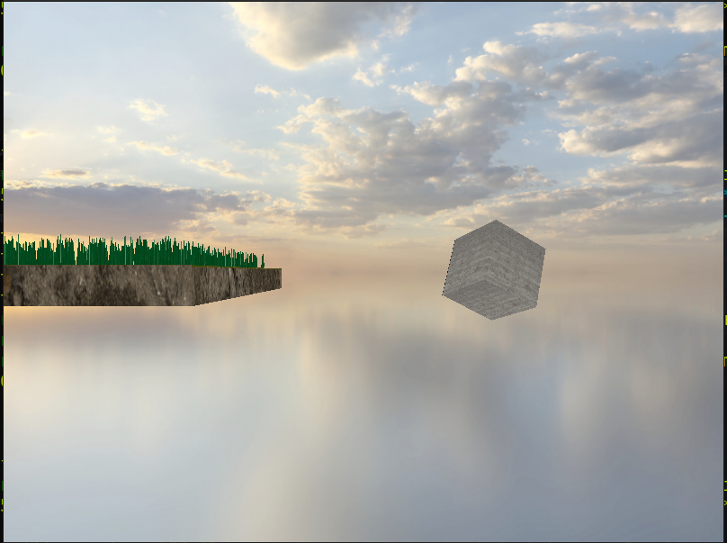

# OpenGL 3D Demo

This is a basic 3D OpenGL Demo in pure C with no abstraction to see the raw implementation. Uses stb_image for image handling.

features: 

- WASD + Mouse controls to see
- Spinning cube with cubemap textures
- Flat plane with textures
- Rendering individual grass blades using instancing
- Skybox





# How to Compile:


Ubuntu (24.04):

```
sudo apt install build-essential
sudo apt install git
sudo apt install libglew-dev
sudo apt install libglfw3
sudo apt install libglfw3-dev
sudo apt install libcglm-dev

git clone https://github.com/tylerwight/opengl_3d_example
cd opengl_3d_example
gcc  -o ./3d_example ./src/3d_example.c  -g -lm -lglfw -lGLEW -lGL
```

then run with `./3d_example`

